#### 双列集合的特点

**键和值 它们是一一对应的关系**

#### Map常见的API

#### Map的遍历方式

#### Map的遍历方式(Lambda表达式)

.png)  

**HashMap的特点**  
  
**HashMap的底层原理**  
**HashMap小结**  
  

**LinkedHashMap**  
  
****  
## TreeMap  
* TreeMap跟TreeSet底层原理一样，都是红黑树结构  
* 由键决定特性: 不重复 无索引 可排序 
* 可排序:对键进行排序
* 注意:默认按键的从小到大进行排序 也可也自己规定键的排序规则  
**TreeMap小结**  

****  

## 代码书写的两种排序规则  
* 实现Comparable接口 ，指定比较规则
* 创建集合时传递Comparator 比较器对象，指定比较规则  
****  
## 可变参数  
  
****  
## Collections  
  
**Collections常用的API**  
  
****  
## 不可变集合
### 创建不可变集合  
*不可变集合:不可以被修改的集合*  
### 不可变集合的应用场景  
*如果某个数据不能被修改，把它防御性的拷贝到不可变集合中是个很好的实践*  
*或者集合对象被不可信的库调用时，不可变形式是安全的*  
*简单理解:不想让别人修改集合里的内容*  
## 创建不可变集合的书写格式  
  
### 不可变集合的特点  
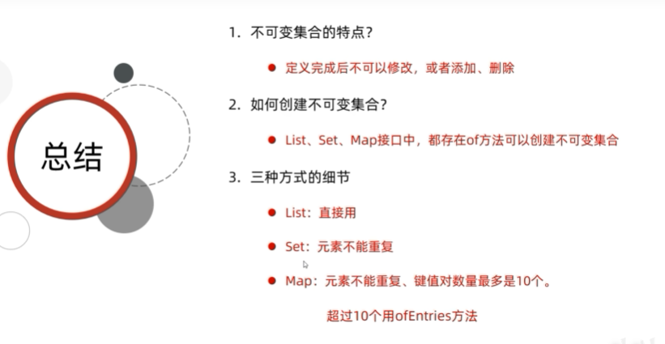  
****  
## Stream流  
### Stream流的思想  
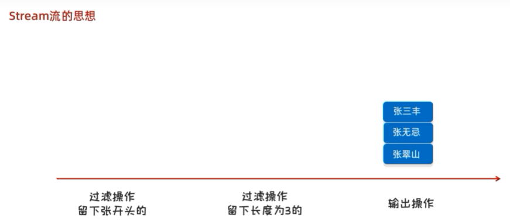  
### Stream流的作用  
*结合了Lambda表达式，简化集合，数组操作*  
### Stream流的使用步骤  
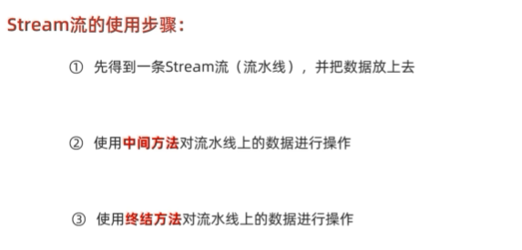  
*Stream流的使用步骤第一步*  
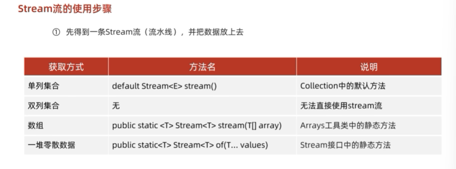  
**注意**  
Stream 接口中静态方法 of 的细节  
方法的形参是一个可变参数，可以传递一堆零散的数据，也可以传递数组  
但是数组必须是引用数据类型的，如果传递基本数据类型，是会把整个数组当做一个元素，放到 Stream 当中。  
#### Stream流的中间方法  
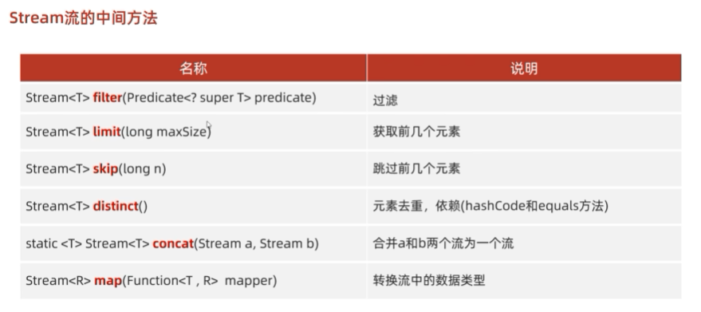  
#### Stream流的终结方法  
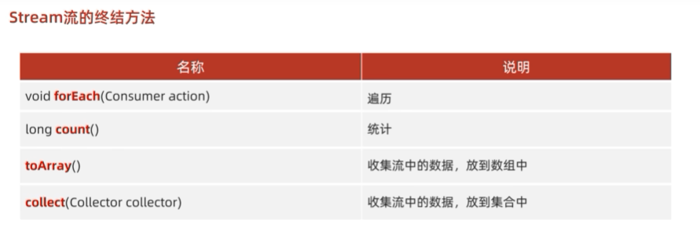  
#### Stream流总结  
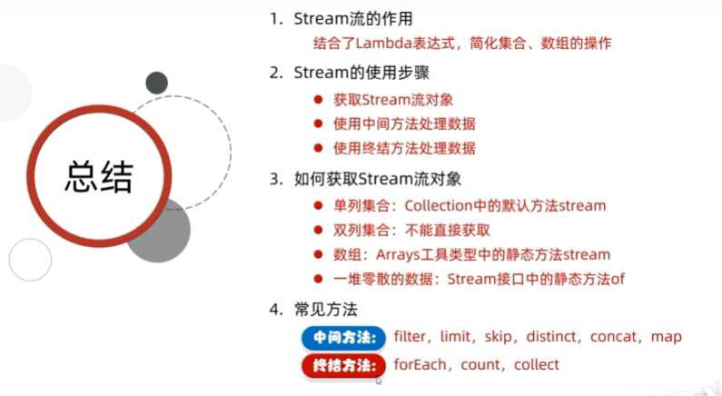  
****  
## 方法引用  
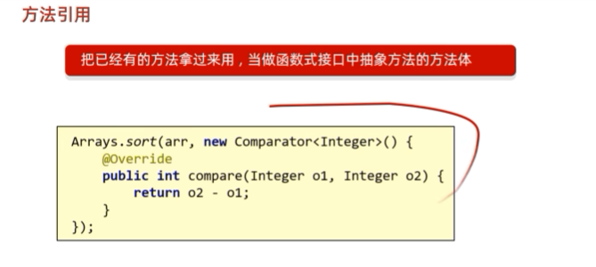  
#### 方法引用的总结  
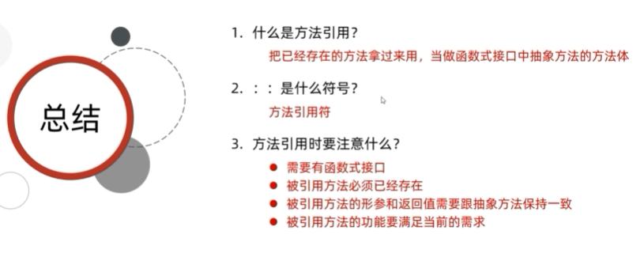  
#### 方法引用的分类  
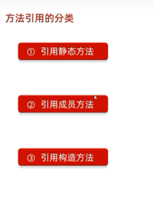  
**引用静态方法**  
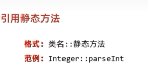  
**引用成员方法**  
  
**引用构造方法**  
  
**使用类名引用成员方法**  
  
**引用数组的构造方法**  
  
**方法引用总结**  
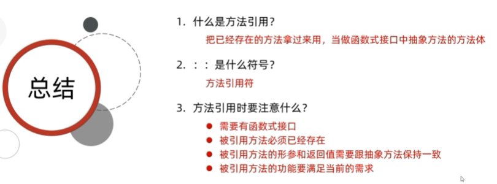  
**方法引用有哪几种**  
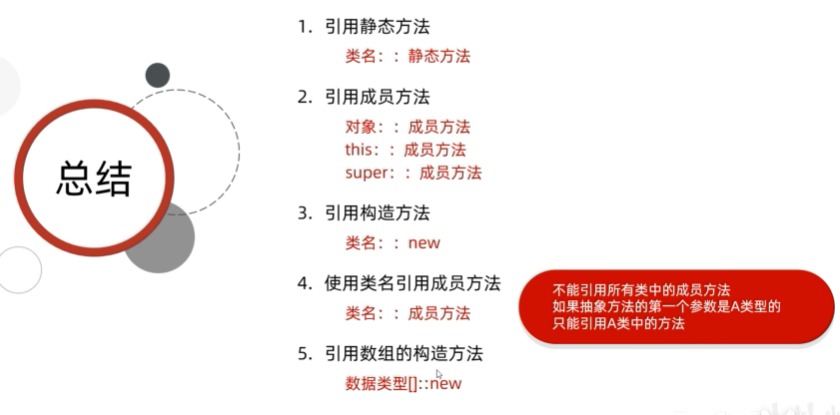