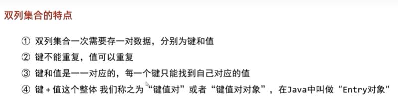
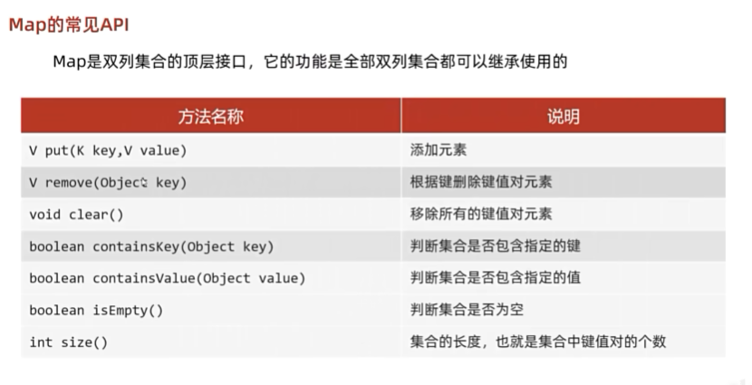
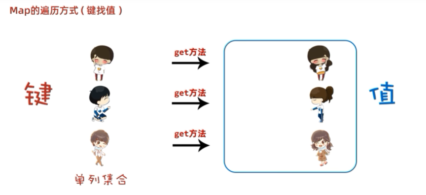
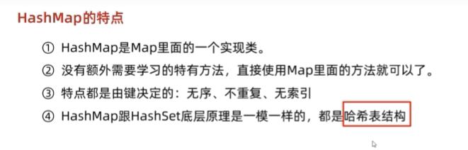
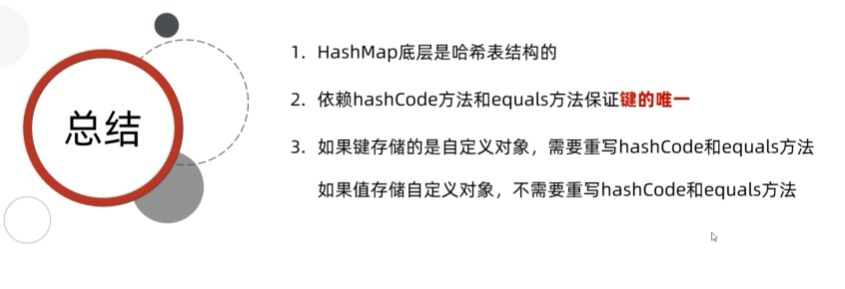
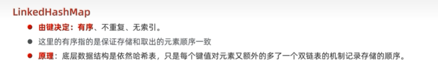
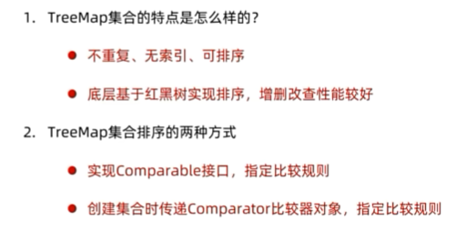
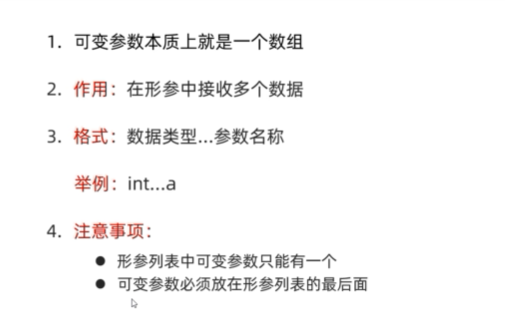
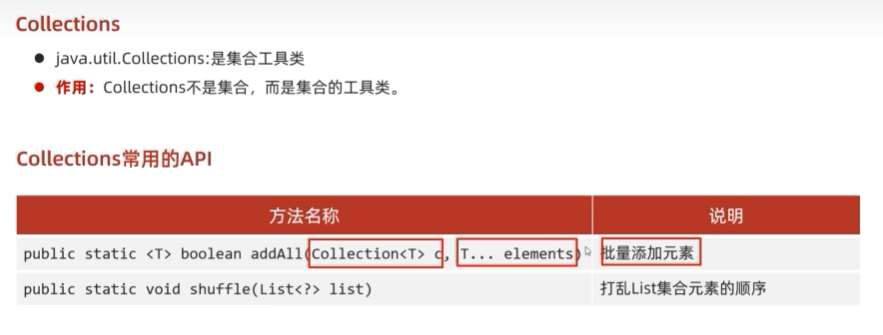
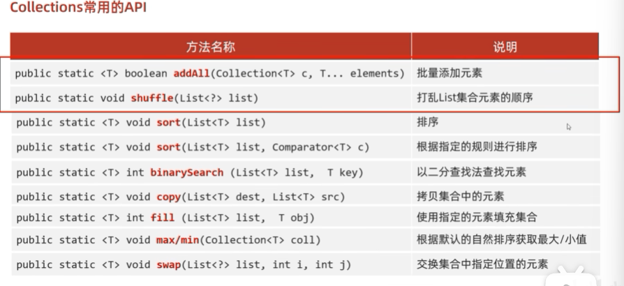

#### 双列集合的特点

**键和值 它们是一一对应的关系**

#### Map常见的API

#### Map的遍历方式

#### Map的遍历方式(Lambda表达式)

.png)  

**HashMap的特点**  
  
**HashMap的底层原理**  
**HashMap小结**  
  

**LinkedHashMap**  
  
****  
## TreeMap  
* TreeMap跟TreeSet底层原理一样，都是红黑树结构  
* 由键决定特性: 不重复 无索引 可排序 
* 可排序:对键进行排序
* 注意:默认按键的从小到大进行排序 也可也自己规定键的排序规则  
**TreeMap小结**  

****  

## 代码书写的两种排序规则  
* 实现Comparable接口 ，指定比较规则
* 创建集合时传递Comparator 比较器对象，指定比较规则  
****  
## 可变参数  
  
****  
## Collections  
  
**Collections常用的API**  
